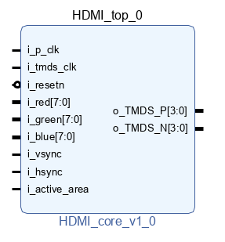

# hdmi-core

A basic HDMI IP core. Takes 8-bit RGB as inputs, outputs TMDS channels. Pixel clock is encoded as o_TMDS_P and o_TMDS_N [3]. 

Tested on Zybo Z7-20, used in Bronco Pong class project. To use, just add the ip folder path to Vivado IP Repositories.